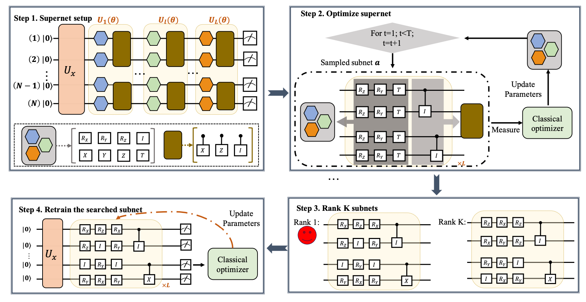

# QAS
This repository includes code in our paper "[Quantum circuit architecture search: error mitigation and trainability enhancement for variational quantum solvers](https://arxiv.org/abs/2010.10217)".

To maximally improve the robustness and trainability of variational quantum algorithms (such as quantum neural networks, variational quantum eigensolvers, and quantum approximate optimization algorithms), here we devise a resource and runtime efficient scheme termed quantum architecture search  (QAS). In particular, given a learning task, QAS automatically seeks a near optimal ansatz (i.e., quantum circuit architecture) to balance benefits and side-effects brought by adding more noisy quantum gates.

Note: To use IBMQ backend, please register an account first.



---

## Requirements
```
pennylane==0.11.0
pennylane-qiskit==0.11.0
qiskit==0.20.1
```

## Baseline results achieved by Hardware-efficient ansatz
* Quantum Machine Learning
  ```shell
  cd machine_learning
  python train.py    # train QNN without noise
  python train.py --noise    # train QNN with noise
  python train.py 10-13-41    # train QNN with the gate arrangement 10-13-41

  ```

* Quantum Chemistry
  ```shell
  cd quantim_chemistry
  python train.py    # train VQE without noise
  python train.py --noise    # train VQE with noise
  python train_search.py 10-13-41    # train VQE with the gate arrangement 10-13-41
  python train_search.py --device ibmq    # train VQE on IBMQ
  python train_search.py --device imbq-sim    # train VQE with IBMQ-simulated noise
  ```

## Simulation results achieved by QAS
* Quantum Machine Learning
  ```shell
  cd machine_learning
  python train_search.py
  python train_search.py --noise    # search ansatz with noise
  python train_search.py --searcher 'evolution' # train QAS and utilize evolutionary algorithms at the ranking state 
  ```
* Quantum Chemistry
  ```shell
  cd quantim_chemistry
  python train_search.py
  python train_search.py --noise    # search ansatz with noise
  python train_search.py --device imbq-sim    # search with IBMQ-simulated noise
  python train_search.py --searcher 'evolution' # train QAS and utilize evolutionary algorithms at the ranking state 
  ```

---

## Citation
If you find our code useful for your research, please consider citing it:
```
@article{du2020quantum,
  title={Quantum circuit architecture search: error mitigation and trainability enhancement for variational quantum solvers},
  author={Du, Yuxuan and Huang, Tao and You, Shan and Hsieh, Min-Hsiu and Tao, Dacheng},
  journal={arXiv preprint arXiv:2010.10217},
  year={2020}
}
```
